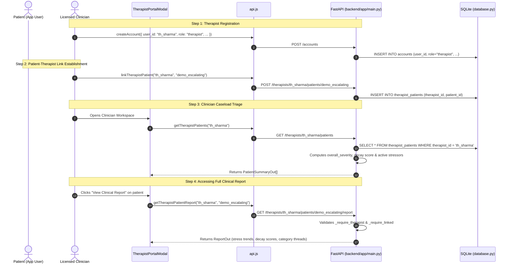
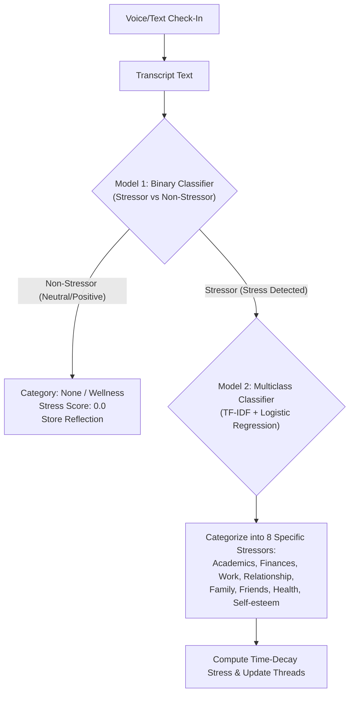

# Breadcrumbs Technical Handoff: Therapist Report Portal & Linking Architecture

This document provides everything needed for the teammate implementing the **Therapist Report Portal & Patient Linking** feature in Breadcrumbs.

---

## 1. How the Therapist-Patient Linking Process Works



---

## 2. Database Schema (SQLite: `backend/app/database.py`)

### 1. `accounts` Table
```sql
CREATE TABLE IF NOT EXISTS accounts (
    user_id TEXT PRIMARY KEY,
    display_name TEXT NOT NULL,
    role TEXT NOT NULL CHECK(role IN ('patient', 'therapist')),
    email TEXT,
    created_at TEXT NOT NULL
);
```

### 2. `therapist_patients` Linking Table
```sql
CREATE TABLE IF NOT EXISTS therapist_patients (
    therapist_id TEXT NOT NULL,
    patient_id   TEXT NOT NULL,
    linked_at    TEXT NOT NULL,
    status       TEXT NOT NULL DEFAULT 'active',
    PRIMARY KEY (therapist_id, patient_id),
    FOREIGN KEY (therapist_id) REFERENCES accounts(user_id),
    FOREIGN KEY (patient_id)   REFERENCES accounts(user_id)
);
```

### 3. `therapist_profiles` Table
```sql
CREATE TABLE IF NOT EXISTS therapist_profiles (
    therapist_id TEXT PRIMARY KEY,
    specialty    TEXT,
    tier         TEXT,
    modes        TEXT,
    address      TEXT,
    city         TEXT,
    lat          REAL,
    lng          REAL,
    rating       REAL,
    updated_at   TEXT NOT NULL,
    FOREIGN KEY (therapist_id) REFERENCES accounts(user_id)
);
```

---

## 3. Backend API Endpoints & Security Checks

### 1. Link a Patient
- **Endpoint**: `POST /therapists/{therapist_id}/patients/{patient_id}`
- **Auth Guard**: Checks `_require_therapist(therapist_id)`.
- **Response**: `{"therapist_id": "...", "patient_id": "...", "linked_at": "...", "status": "active"}`

### 2. List Caseload (Triage View)
- **Endpoint**: `GET /therapists/{therapist_id}/patients`
- **Auth Guard**: `_require_therapist(therapist_id)`
- **Response**: Array of `PatientSummaryOut`:
  ```json
  [
    {
      "patient_id": "demo_escalating",
      "display_name": "Alex",
      "linked_at": "2026-09-18T12:00:00Z",
      "overall_severity": "high",
      "overall_decay_score": 0.82,
      "active_stressor_count": 3,
      "entry_count": 7
    }
  ]
  ```

### 3. Fetch Full Clinical Report
- **Endpoint**: `GET /therapists/{therapist_id}/patients/{patient_id}/report?period=last%2014%20days`
- **Auth Guard**:
  - `_require_therapist(therapist_id)`: Verifies role is therapist.
  - `_require_linked(therapist_id, patient_id)`: Verifies patient exists in therapist's caseload.
- **Response**: `ReportOut` containing:
  - `overall_severity`: `"low" | "moderate" | "high" | "flagged"`
  - `overall_decay_score`: Float between `0.0` and `1.0` (time-weighted exponential decay)
  - `stressors`: Array of threaded categories with `trend` (`improving`, `escalating`, `stable`), `current_decay_score`, `recent_triggers`, `entry_count`
  - `crisis_resources_shown`: Boolean indicating acute risk triggers

### 4. Fetch Raw Patient Entries (Clinician Review)
- **Endpoint**: `GET /therapists/{therapist_id}/patients/{patient_id}/entries`
- **Auth Guard**: `_require_therapist` + `_require_linked`
- **Response**: Array of `EntryOut` (`id`, `date`, `transcript`, `category`, `stress_score`, `confidence`, `reason`).

---

## 4. How to Wire the Frontend UI

### Step 1: Add API Client Functions in `frontend/src/services/api.js`
Ensure these functions are exported:
```javascript
export async function getTherapistPatientReport(therapistId, patientId, period = 'last 14 days') {
  const res = await fetch(`${API_BASE}/therapists/${therapistId}/patients/${patientId}/report?period=${encodeURIComponent(period)}`);
  if (!res.ok) throw new Error('Failed to fetch patient report');
  return res.json();
}

export async function getTherapistPatientEntries(therapistId, patientId) {
  const res = await fetch(`${API_BASE}/therapists/${therapistId}/patients/${patientId}/entries`);
  if (!res.ok) throw new Error('Failed to fetch patient entries');
  return res.json();
}
```

### Step 2: Connect `ReportModal.jsx` to `TherapistPortalModal.jsx`
1. In [`TherapistPortalModal.jsx`](file:///c:/Breadcrumbs-/frontend/src/components/TherapistPortalModal.jsx), import [`ReportModal.jsx`](file:///c:/Breadcrumbs-/frontend/src/components/ReportModal.jsx).
2. Add a state: `const [selectedPatientReportId, setSelectedPatientReportId] = useState(null);`
3. In each patient card in the triage list, add a button:
   ```jsx
   <TouchableOpacity
     style={styles.viewClinicalReportBtn}
     onPress={() => setSelectedPatientReportId(patient.patient_id)}
   >
     <Text style={styles.viewClinicalReportBtnText}>📊 View Clinical Report & Trends</Text>
   </TouchableOpacity>
   ```
4. Render `<ReportModal visible={!!selectedPatientReportId} onClose={() => setSelectedPatientReportId(null)} userId={selectedPatientReportId} />`.

> [!IMPORTANT]
> **Clinical Boundary Rule**:
> - Patients must **never** see raw stress numbers or clinical severity badges.
> - Only therapists inside `TherapistPortalModal` have authorization to open `ReportModal`!

---

## 5. Upcoming Model 1 (Binary Stressor vs Non-Stressor) Integration Plan

When the binary stressor classification model arrives:



### Where to Place the Model Files:
- Place `model1_vectorizer.pkl` and `model1_classifier.pkl` in `backend/app/`.
- In `backend/app/categorize.py`, add `classify_is_stressor(text: str) -> bool`.
- In `backend/app/pipeline.py` (`process_text_entry`), run `is_stress = classify_is_stressor(transcript)`:
  - If `False`: log as low/neutral wellness reflection.
  - If `True`: invoke `categorize_with_reason(transcript)` with Model 2.
